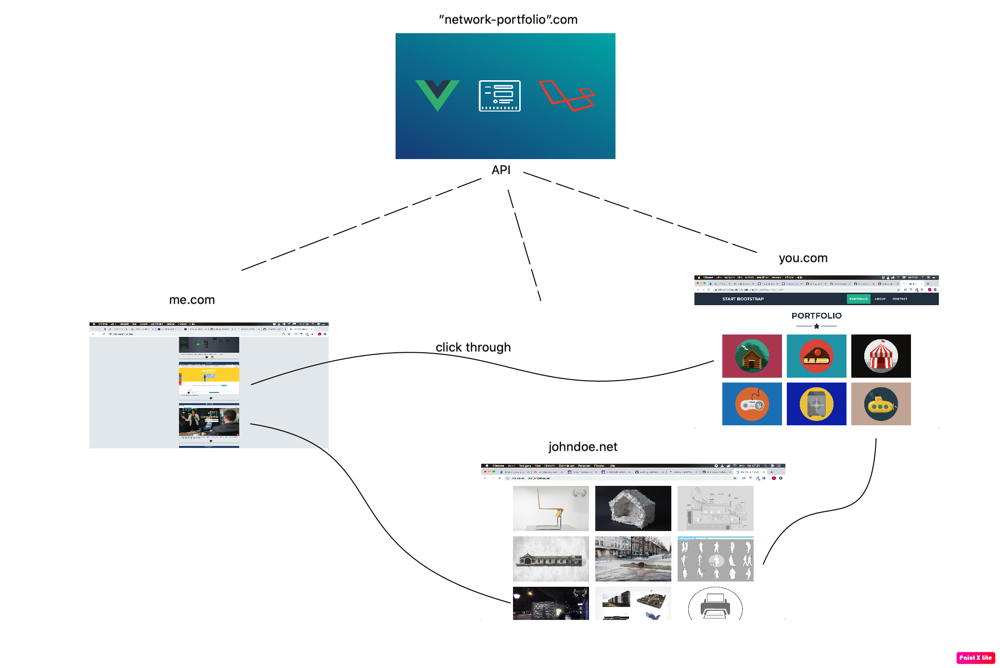

## A network portfolio built with Laravel/Vue/tailwindcss
Did you find yourself without a portfolio, even though you did do some interesting projects in the past? These projects might have been achieved together with friends or partners? Let's investigating how to make a connected "network portfolio" where we can share these projects across our personal websites!

Sounds interesting? Please take this [survey](https://docs.google.com/forms/d/e/1FAIpQLSflof9NgS6T14WwXv4tL7Z8CRWb0bL4Xz4uj5we_qlBZOgzIQ/viewform?usp=sf_link). It really will help building a better product.

Or feel free to chat in the [collaboratours wanted issue](www.google.com).

### Features (for a MVP)
* Sign up with github
* Add a project on the hub (add name, description, links, images etc)
* Add/remove collaboratours to projects
* Project owner and project collaboratour must both be able to approve/decline the collaboration listing.
* Consume the hub project API to populate a personal portfolio website. The project should provide a sample implementation.

### Roadmap
* research
* find collaboratuors
* scaffold and seed basic API
* build a frontend for adding/managing projects
* create a sample implementation using the API (a personal portfolio to be deployed on a personal domain)

### Development installation
git clone
php artisan migrate:fresh --seed
yarn
yarn dev && yarn watch
